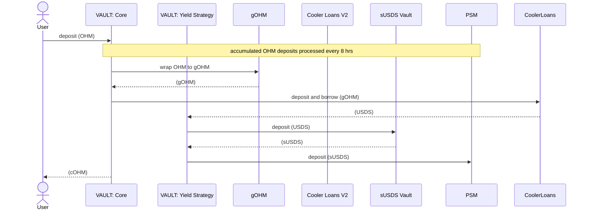
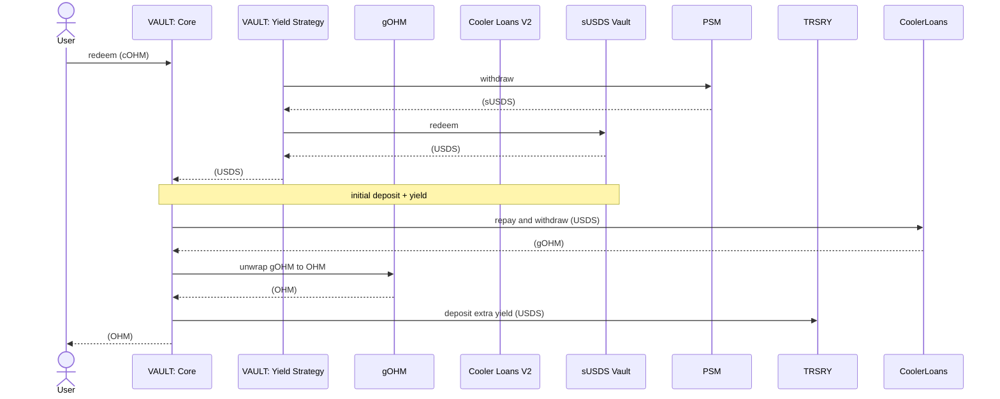

# Technical Details for Callisto Vault Audit

## In-Scope Contracts

- `src/`

  - `external/`

    - [ConverterToWadDebt.sol](../src/external/ConverterToWadDebt.sol)

    - [DebtTokenMigrator.sol](../src/external/DebtTokenMigrator.sol)

    - [VaultStrategy.sol](../src/external/VaultStrategy.sol)

  - `policies/`

    - [CallistoVault.sol](../src/policies/CallistoVault.sol)

## Protocol Overview

The __Callisto protocol__ is purpose-built for the [Olympus ecosystem](https://www.olympusdao.finance/), __enabling advanced use-cases for `OHM` holders__. It directly interacts with the Olympus contracts and ecosystem tokens ([`OHM`](https://etherscan.io/address/0x64aa3364F17a4D01c6f1751Fd97C2BD3D7e7f1D5), [`gOHM`](https://etherscan.io/address/0x0ab87046fBb341D058F17CBC4c1133F25a20a52f)), and utilizes [Olympus Cooler Loans V2](https://app.olympusdao.finance/#/lending/cooler) ([`MonoCooler`](https://etherscan.io/address/0xdb591Ea2e5Db886dA872654D58f6cc584b68e7cC)).

__Olympus Cooler Loans V2 allows users to borrow up to ~95% of the `OHM` backing value__ ([currently, at ~\$11.54](https://app.olympusdao.finance/#/dashboard)). _To borrow, users need first to wrap `OHM` into `gOHM` using [the Olympus staking](https://etherscan.io/address/0xB63cac384247597756545b500253ff8E607a8020). `gOHM` is used as collateral, [`USDS`](https://etherscan.io/address/0xdC035D45d973E3EC169d2276DDab16f1e407384F) as the loan token._ However, __when the market value of `OHM` ([currently, at ~\$19](https://coingecko.com/en/coins/olympus)) trades at a premium, users are constrained by the [LTV based on the backing value](https://etherscan.io/address/0x9ee9f0c2e91E4f6B195B988a9e6e19efcf91e8dc#readContract#F7)__, missing out on the full market value. __Callisto solves this__.

__The core of the protocol is the [Callisto vault](../src/policies/CallistoVault.sol)__. It is an ERC4626 vault that __accepts `OHM`__, utilizes its value __and mints `cOHM` shares 1:1__ in return.

__With `cOHM`, users can__:

1. __Borrow `COLLAR` (Callisto stablecoin)__ in the Callisto CDP, with collateral valued at the current market price of `OHM` vs its backing value. `cOHM`-`OHM` are always 1:1, `COLLAR`-`USDS` are assumed to be always 1:1.

   Two primary use-cases follow:

   1. __Deposit `COLLAR` in the CDP Stability Pool__ to secure the protocol and earn a portion of interest paid by borrowers and collateral fees from liquidations.

   2. __Swap `COLLAR` for `USDS`__ in the [Callisto Peg Stability Module (PSM)](../src/external/CallistoPSM.sol) at a fixed 1:1 rate. Because borrowing is based on the market value, users receive more `USDS` than if borrowing from Cooler V2 directly.

   In addition, `COLLAR` borrowers can utilize the governance voting power of `gOHM` corresponding to their `cOHM` collateral value. See [How the Callisto Vault Utilizes OHM](#how-the-callisto-vault-utilizes-ohm).

2. __Deposit `cOHM` into Callisto Convertible Deposits (CDs)__ to lock conversion terms for [`CALL` (Callisto governance token)](../src/external/CallistoToken.sol).

__Users may redeem `OHM` for `cOHM` at any time__ using the vault's `withdraw()` or `redeem()` functions.

_Future plans include cross-chain interactions, which involve bridging `cOHM` to other networks._

## How the Callisto Vault Utilizes OHM

When __users deposit OHM assets__, they are accumulated in `pendingOHMDeposits` and __`cOHM` shares are minted to depositors__. At a pre-defined frequency (e.g. every 8 hrs), accumulated deposits are processed by calling the `execute()` function through the Callisto heart `beat` (more in [The Protocol Architecture](#the-protocol-architecture)), with keepers earning rewards in [`CALL`](../src/external/CallistoToken.sol) governance token. Accumulation of pending deposits allows to reduce overall gas costs for depositors._

During each processing of pending deposits, __the vault borrows `USDS`__ at the maximum allowed LTV, wrapping `OHM` into `gOHM` and depositing `gOHM` to Cooler V2. The Vault Strategy then __deposits `USDS` into the [`sUSDS` vault](https://etherscan.io/address/0xa3931d71877C0E7a3148CB7Eb4463524FEc27fbD)__ (the Sky protocol) __to earn yield and supplies `sUSDS` to the Callisto PSM via `VaultStrategy.invest()`__. _The PSM allows users to swap `COLLAR` for `USDS` and vice-versa at a fixed 1:1 rate, stabilizing the price of `COLLAR`. The vault is the main liquidity provider for the PSM, supplying it with `sUSDS` via [its strategy](../src/external/VaultStrategy.sol)._

_The maximum loan amount is determined by the [origination LTV](https://etherscan.io/address/0x9ee9f0c2e91E4f6B195B988a9e6e19efcf91e8dc#readContract#F7) in Cooler V2, currently at ~95% of the `OHM` backing value._

__Yield from `sUSDS` is used first to repay the vault's `USDS` debt (the 0.5% APY in Cooler V2). Any surplus yield is sent to the [Callisto treasury](../src/modules/TRSRY/CallistoTreasury.sol)__.

Voting power for `gOHM` collateral in Cooler Loans V2 is held by the vault and delegated to `cOHM` holders when they deposit into the CDP. The Callisto CDP delegates using `CallistoVault.applyDelegations()` for this purpose.

## The Protocol Architecture

The Callisto protocol is built using the [Default framework](https://github.com/fullyallocated/Default) (utilizing the [Olympus V3](https://github.com/OlympusDAO/olympus-v3) approach), which provides a proxy-free upgradeability model. The `Kernel` contract manages modules, upgradeable by replacement, and policies, that use modules as dependencies via permissioning. When a module is upgraded, the kernel updates its address in dependent pocilies.

### Contracts

#### Default Contracts

- [__`Kernel`__](../src/Kernel.sol) acts as a central component registry by managing [`modules`](https://github.com/CallistoDAO/callisto-sandbox/blob/75619be21d5d0b53724224c0fa269de0ac6acc12/src/Kernel.sol#L95) and [`policies`](https://github.com/CallistoDAO/callisto-sandbox/blob/75619be21d5d0b53724224c0fa269de0ac6acc12/src/Kernel.sol#L126) via predefined [`Actions`](https://github.com/CallistoDAO/callisto-sandbox/blob/75619be21d5d0b53724224c0fa269de0ac6acc12/src/Kernel.sol#L9).

- Modules:

  - [__`ROLES`__](../src/modules/ROLES/CallistoRoles.sol) manages roles for policies.

  - [__`TRSRY`__](../src/modules/TRSRY/CallistoTreasury.sol) implements the protocol treasury by managing all other assets under the control of the protocol.

  - [__`MINTR`__](../src/modules/MINTR/CallistoMinter.sol) mints and burns the `CALL` governance token.

- Policies:

  - [__`CallistoVault`__](../src/policies/CallistoVault.sol) (`cOHM`) is a core contract of the protocol that issues/handles `cOHM` shares.

  - [__`CallistoHeart`__](../src/policies/CallistoHeart.sol) provides keepers with a reward in `CALL` for processing pending OHM deposits in the Callisto vault. It is implemented by the `beat` function which calls the Callisto vault's `execute()`.

  - [__`RolesAdmin`__](../src/policies/RolesAdmin.sol) grants and revokes `Roles` through the `ROLES` module.

#### External Contracts

- [__VaultStrategy__](../src/external/VaultStrategy.sol) manages the vault's strategy for borrowed debt token (`USDS`).

- [__ConverterToWadDebt__](../src/external/ConverterToWadDebt.sol) handles conversions from Olympus's wad to the original decimals of the debt token (`USDS`).

- [__DebtTokenMigrator__](../src/external/DebtTokenMigrator.sol) is responsible for migrating to a new debt token if Olympus replaces the debt token. See [Debt Token Migration](#debt-token-migration) for details.

- __Callisto governance__ operates the protocol through the Default framework and direct management of the treasury.

- __Callisto Gnosis Safe__ is a multisig wallet that:

  - acts as a manager over a set of functions (refer to [Access Control](#access-control));

  - temporarily facilitates governance-related operations until the governance contracts are deployed.

- __`COLLAR` (__the Callisto stablecoin)__ is minted by the Callisto CDP against `cOHM` collateral and additionally backed by `USDS` in the PSM.

- [____Callisto PSM (the peg stability module)__](../src/external/CallistoPSM.sol) stabilizes the USDS-COLLAR peg by enabling swaps between `USDS` and `COLLAR` at a 1:1 rate (unless the fee is enabled). Liquidity is sourced primarily from the vault in `sUSDS`.

- [__Callisto governance token (`CALL`)__](../src/external/CallistoToken.sol).

- __Callisto CDP__ is a [Liquity-v1-style](https://github.com/liquity/dev) collateralized debt position market for minting `COLLAR` against `cOHM`, with liquidation mechanisms to maintain system solvency.

- __Callisto convertible deposits (CDs)__ is a set of contracts that provide a mechanism for the protocol to operate an auction that is infinite duration and infinite capacity. Bidders are required to deposit the configured reserve token (`cOHM`) into the auctioneer, and in return they receive a convertible deposit token (`cdcOHM`) that can be converted into the configured bid token (`CALL`) or redeemed for the deposited reserve token at terms accepted at deposit.

## Callisto Vault Implementation Details

The vault inherits OpenZeppelin `ERC4626` and overrides some functions to implement a 1:1 asset-to-share ratio. `OHM` assets have 9 decimals and `cOHM` shares have 18 decimals. `cOHM` transferable shares are implemented as ERC20. [`CallistoVault`](../src/policies/CallistoVault.sol) implements core functions and extends `ReentrancyGuardTransient` for protection against reentrancy attacks.

`deposit()` and `mint()` deposits `OHM`, mints `cOHM`, and increases `pendingOHMDeposits` by the deposited `OHM` amount.

`execute()` processes accumulated `pendingOHMDeposits` via the Callisto heart to reduce gas costs of `deposit()`. See: [How the Callisto Vault Utilizes OHM](#how-the-callisto-vault-utilizes-ohm). `execute()` is replaced with `processPendingDeposits()` in non-ZeroWarmup modes (See: [OHM-gOHM Exchange](#ohm-gohm-exchange)).

The yield generation logic is described in [How the Callisto Vault Utilizes OHM](#how-the-callisto-vault-utilizes-ohm) and implemented in [`VaultStrategy`](../src/external/VaultStrategy.sol). `sweepProfit()` moves surplus yield to the treasury. _`VaultStrategy` is implemented as a separate contract to reduce the bytecode size and prepare the Callisto vault to be used as a base for other vaults that interact with Cooler V2._

`setDepositsPause()` and `setWithdrawalsPause()` allow the Callisto governance and the manager multisig to pause deposits and withdrawals separately, and `sweepTokens()` to withdraw tokens that have been inadvertently transferred to the Callisto vault.

Role-based access for restricted methods and dependency configuration for the Default kernel contract are described in [`CallistoVault`](../src/policies/CallistoVault.sol). The [kernel contract](../src/Kernel.sol) sets the addresses of the Callisto [treasury](../src/modules/TRSRY/CallistoTreasury.sol) and [role](../src/modules/ROLES/CallistoRoles.sol) modules using `configureDependencies()`.

`repayCoolerDebt()`, `claimReimbursement()`, and `emergencyRedeem()` are described in [Emergency Liquidation of the Vault Position in Cooler V2](#emergency-liquidation-of-the-vault-position-in-cooler-V2).

`migrateDebtToken()` is used by the [`DebtTokenMigrator` contract](../src/external/DebtTokenMigrator.sol) to migrate the debt token (`USDS`) to a different one if Olympus changes Cooler's debt token. The migrator address is set via `setDebtTokenMigrator()`. See: [Debt Token Migration](#debt-token-migration).

### Olympus-Related Considerations

#### `OHM`-`gOHM` Exchange

The Olympus staking allows direct `OHM`-`gOHM` conversion in a single transaction and, although low likelihood, the Olympus governance could technically activate the warm-up period. By default, the Callisto vault is in `OHMToGOHMMode.ZeroWarmup`. If the warm-up period is enabled, `OHM` is required to be staked for a certain time period using [`OlympusStaking.stake()`](https://etherscan.io/address/0xB63cac384247597756545b500253ff8E607a8020#writeContract#F7), and claimed after through [`OlympusStaking.claim()`](https://etherscan.io/address/0xB63cac384247597756545b500253ff8E607a8020#writeContract#F1).

In this scenario, the Callisto protocol can activate `OHMToGOHMMode.Swap`, allowing the Callisto governance to set a custom [`IOHMSwapper`](../src/interfaces/IOHMSwapper.sol) using `setSwapMode()`. The specified swapper contract can use any supported exchange, performing slippage checks and other parameter validations as required. In this mode, the Callisto heart's `execute()` is disabled and `OHM` deposits are processed using `processPendingDeposits()`.

Alternatively, if the Callisto protocol opts to wait out the warm-up period, it can enable `OHMToGOHMMode.ActiveWarmup`. In this mode, `OHM` is staked via `processPendingDeposits()`, the staked amount is recorded in `pendingOHMWarmupStaking`, and after the warm-up period ends, a subsequent call to `processPendingDeposits()` claims the corresponding `gOHM`.

Olympus Cooler Loans V2 resets a warm-up period if increasing a stake before claiming. Therefore, `processPendingDeposits()` reverts until the warm-up period is over for `pendingOHMWarmupStaking`. If `pendingOHMWarmupStaking` needs to be withdrawn, for example, to switch to `OHMToGOHMMode.Swap` or to increase the stake, the Callisto governance (or the manager multisig) can use `cancelOHMStake()`.

Mode switching is handled by `setZeroWarmupMode()`, `setActiveWarmupMode()`, and `setSwapMode()` functions, which ensure that the modes are switched correctly with proper validation.

#### Debt Token Decimals

Cooler V2 always `borrow()` and `repay()` return values in wad (18 decimals) rather than in the original debt token decimals. The `ICoolerTreasuryBorrower.convertToDebtTokenAmount()` function is responsible for the conversion. The current debt token (`USDS`) uses 18 decimals, so there is no conversion. The conversion can be implemented if the debt token is replaced. The Callisto vault uses the Olympus's `CoolerTreasuryBorrower.convertToDebtTokenAmount()` to convert to original token decimals as needed. Conversions to wad are implemented using `ConverterToWadDebt.toWad()`, since [`CoolerTreasuryBorrower`](https://etherscan.io/address/0xD58d7406E9CE34c90cf849Fc3eed3764EB3779B0) does not provide such a function.

#### Debt Token Migration

The Olympus governance can theoretically replace the debt token (currently `USDS`). The vault supports this migration, coordinated via `DebtTokenMigrator`.

This process involves:

- Exchanging all existing `USDS` in the Callisto PSM for a new debt token.
- Updating the address of the token and the yield generating vault in the Callisto PSM, Callisto vault and its strategy.
- Replacing the Callisto vault's converter for debt token amounts from Olympus wad to decimals of the debt token.
- Converting the number of debt tokens supplied to the Callisto PSM into the new decimals.

It is assumed that the Callisto governance sets migration parameters with `DebtTokenMigrator.setMigration()`:

- the slippage defining the acceptable loss percentage when exchanging `USDS` for a new debt token;
- the address of the new yield generating vault;
- the converter address for the Callisto vault;
- the timestamp from which the migration can be executed.

After the timestamp has passed, anybody can use a flash loan to provide the required amount of the new debt token, receive previous debt tokens and swap them to repay the flash loan and clear out profits.

#### `OHM` Rebasing Activation

Olympus previously supported the `OHM` rebasing mechanism, where staked `OHM` increased in quantity over time. Although rebasing is currently disabled, the Callisto vault is engineered to support its potential reactivation. If re-enabled, `gOHM` would appreciate relative to `OHM`, possibly resulting in surplus `gOHM` collateral within the vault's Cooler V2 position.

To address this, the vault provides `withdrawExcessGOHM()`, permitting `ADMIN` and `MANAGER` roles to extract surplus `gOHM` without disrupting core operations. The function determines the safe withdrawal amount via `excessGOHM()` and executes the transfer.

This mechanism ensures that rebasing gains do not remain locked in the vault and are redirected to benefit the protocol.

### Essential Vault Logic Nuances

The following aspects may require more careful attention during code analysis.

#### Emergency Liquidation of the Vault Position in Cooler V2

In the event that the vault's position in Olympus Cooler V2 is liquidated (i.e., the gOHM collateral is seized), the vault provides several mechanisms for users to recover value:

1. **Standard Withdrawal**: Users can first attempt standard `withdraw()` or `redeem()` operations, which may succeed if there are:
   - Pending OHM deposits not yet processed (`pendingOHMDeposits`)
   - Additional OHM transferred to the vault to compensate for lost collateral

2. **Emergency Redemption**: If standard withdrawal fails, users can call `emergencyRedeem()` to claim a proportional share of remaining strategy funds. The amount is calculated as:

   ```
   debtAmount = shares * totalAssetsInvested / totalSupply
   ```

3. **Reimbursement Claims**: Users who previously used `repayCoolerDebt()` to help prevent liquidation can claim reimbursements via `claimReimbursement()`.

The vault automatically detects liquidation by checking if `totalAssetsInvested > 1` while `gOHMCollateral == 0`.

#### Remaining Token Unit Because of Migrating to a Debt Token with Lower Decimals

When migrating to a debt token with fewer decimals than the current token, division during conversion may round up to ensure the vault receives exactly enough tokens to cover its debt. This can result in a small remainder (typically 1 token unit) in the strategy after all deposits are withdrawn.

The vault's liquidation detection logic accounts for this by using `totalAssetsInvested > 1` instead of `!= 0` to determine if the position is truly empty. This prevents false positives during debt token migrations while maintaining accurate liquidation detection per [Cooler V2's minimum debt requirement](https://etherscan.io/address/0xdb591Ea2e5Db886dA872654D58f6cc584b68e7cC#readContract#F27).

## The Basic Flow for the Callisto Vault

### Deposit Flow

1. User calls `deposit()` or `mint()` with OHM
2. Vault mints cOHM shares 1:1 with OHM (accounting for decimal differences)
3. OHM is added to `pendingOHMDeposits` awaiting batch processing
4. Callisto Heart calls `execute()` periodically to process pending deposits:
   - Converts OHM to gOHM via Olympus Staking (mode-dependent)
   - Deposits gOHM as collateral in Cooler V2
   - Borrows maximum USDS at origination LTV
   - Invests USDS in strategy (sUSDS vault → PSM)

### Withdrawal Flow

1. User calls `withdraw()` or `redeem()` with desired amounts
2. If sufficient OHM in `pendingOHMDeposits`, transfer directly
3. Otherwise, complex withdrawal process:
   - Calculate required gOHM to obtain lacking OHM
   - Determine debt repayment needed for gOHM withdrawal
   - Divest funds from strategy (or use caller contribution + reimbursement)
   - Repay debt and withdraw gOHM from Cooler V2
   - Convert gOHM back to OHM via Olympus Staking
   - Transfer OHM to user, burn cOHM shares

### Yield Management

- Strategy earns yield on USDS via sUSDS vault
- Yield first covers Cooler V2 interest payments
- Surplus yield swept to treasury via `sweepProfit()`
- PSM liquidity maintained through strategy deposits

## Access Control

The Callisto vault implements a role-based access control through Default.

## Restricted Functions of the Callisto Vault

| Action                      | Admin | Manager | Heart | CDP | Debt token migrator | Kernel |
|-----------------------------|-------|---------|-------|-----|---------------------|--------|
| applyDelegations()          | :heavy_check_mark:     |         |       | :heavy_check_mark:   |                     |        |
| cancelOHMStake()            | :heavy_check_mark:     | :heavy_check_mark:       |       |     |                     |        |
| setDepositsPause()          | :heavy_check_mark:     | :heavy_check_mark:       |       |     |                     |        |
| setWithdrawalsPause()       | :heavy_check_mark:     | :heavy_check_mark:       |       |     |                     |        |
| setZeroWarmupMode()         | :heavy_check_mark:     |         |       |     |                     |        |
| setActiveWarmupMode()       | :heavy_check_mark:     |         |       |     |                     |        |
| setSwapMode()               | :heavy_check_mark:     |         |       |     |                     |        |
| setMinDeposit()             | :heavy_check_mark:     | :heavy_check_mark:       |       |     |                     |        |
| setDebtTokenMigrator()      | :heavy_check_mark:     |         |       |     |                     |        |
| sweepTokens()               | :heavy_check_mark:     | :heavy_check_mark:       |       |     |                     |        |
| withdrawExcessGOHM()        | :heavy_check_mark:     | :heavy_check_mark:       |       |     |                     |        |
| sweepProfit()               | :heavy_check_mark:     | :heavy_check_mark:       |       |     |                     |        |
| execute()                   |       |         | :heavy_check_mark:     |     |                     |        |
| migrateDebtToken()          |       |         |       |     | :heavy_check_mark:                   |        |
| configureDependencies()     |       |         |       |     |                     | :heavy_check_mark:      |

### Role Descriptions

- __Admin__: the `CommonRoles.ADMIN` role of the administrator which is a high-level governance role that can configure vault parameters, pause operations, and manage emergency functions.
- __Manager__: the `CommonRoles.MANAGER` role of the manager which temporarily facilitates governance-related operations until the governance contracts are deployed.
- __Heart__: the `CallistoVault.HEART_ROLE` role of the Callisto heart policy with which keepers regularly process pending OHM deposits.
- __CDP__: the Callisto CDP (`CallistoVault.CDP_ROLE`) which applies delegations for `gOHM` collateral through Olympus Cooler Loans V2.
- __Debt token migrator__: the contract for debt token migration (set via `setDebtTokenMigrator()`).
- __Kernel__: the kernel contract (`CallistoVault.onlyKernel()`).

## Visualization

### Deposit

`OHM` deposits are accumulated in `pendingOHMDeposits` and processed periodically by the Callisto heart:



#### Withdrawal

Withdrawals are processed on-demand, provided the PSM has sufficient liquidity:


